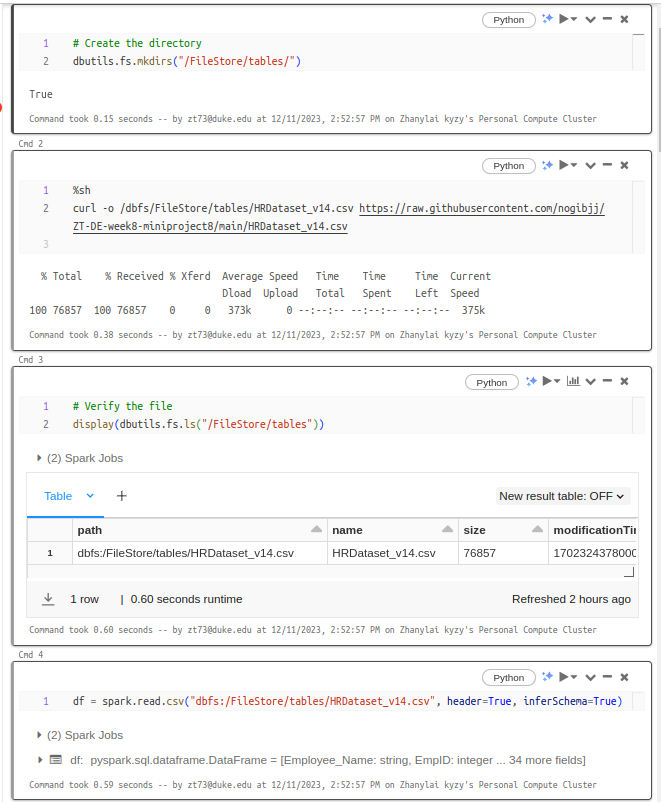
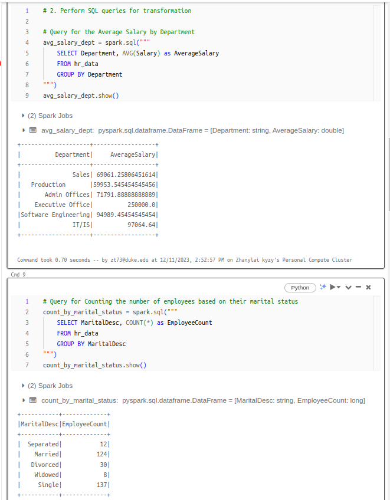
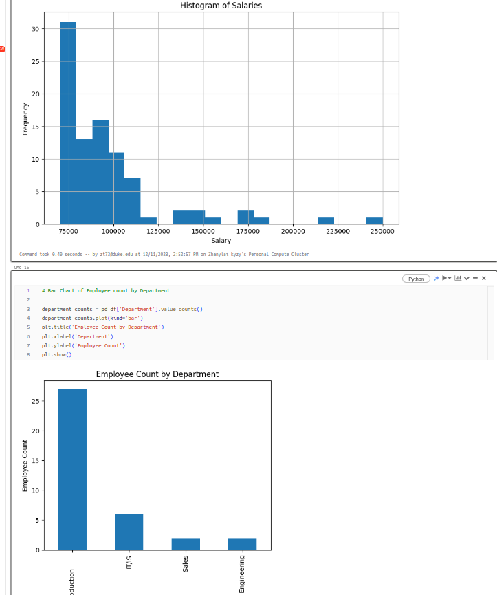
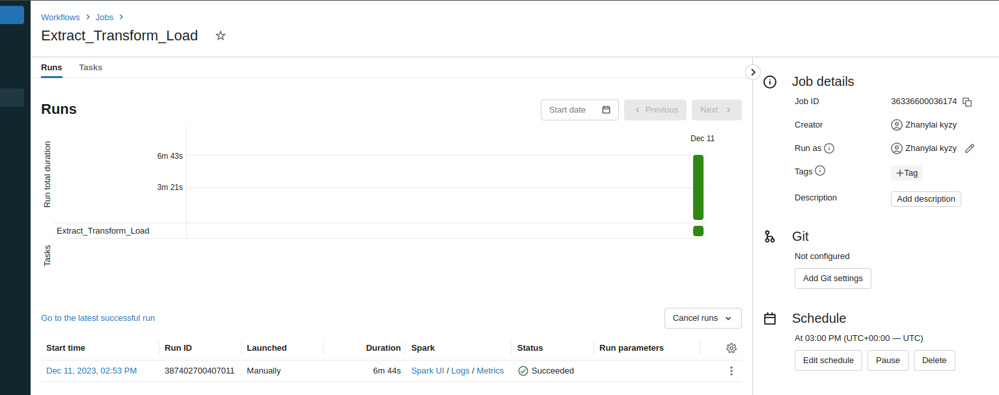

# Databricks ETL Pipeline Project

## Overview
This project demonstrates an ETL (Extract, Transform, Load) pipeline using Databricks, focusing on HR data analysis. The process includes data ingestion, transformation, storage, and visualization.

## Pipeline Steps
- **Data Ingestion**: Data from a CSV file is ingested into a DataFrame.
- **Data Transformation**: Performed using Spark SQL to generate insights.
- **Data Storage**: Data stored in Delta Lake to leverage versioning and efficient storage.
- **Data Visualization**: Graphical representation of the transformed data for better understanding.

## Conclusion and Recommendation
- The project reveals key insights into the HR dataset, highlighting departmental employee distribution and salary ranges.
- Recommendations include considering salary restructuring to ensure competitive compensation.

## Screenshots
Include the following screenshots in your README:
1. **Data Ingestion Step**:
3. **Data Transformation**:
4. **Visualizations**:
5. **Pipeline Configuration**:

Link for Demo:https://vimeo.com/893524012/4fd835ea43?share=copy
